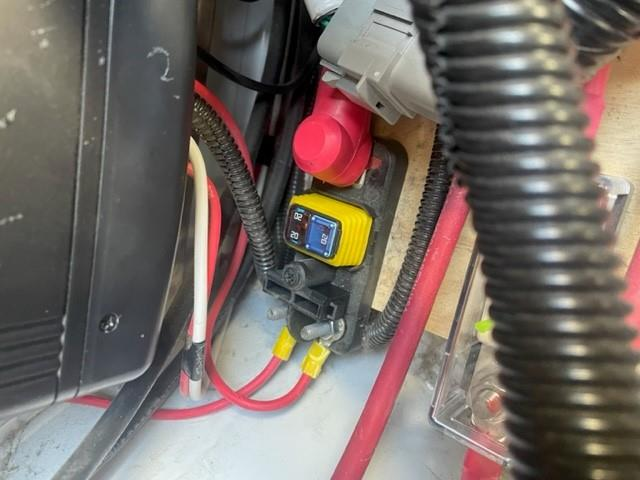
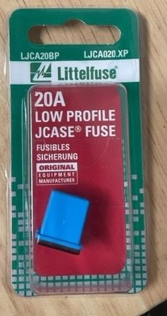

## A 12VDC thing doesn't work

### 2021 and older

Have a typical 12VDC fuse box located behind an access cover on the volta cabinet. Refer to your owners manual/fuse diagram for applicable fuses.

reference: fuse panel location

reference: fuse panel itself

### 2022 and newer

Use PDMs (Power Distribution Modules). To reset them, power down system for 1 minute and power back up. You can view PDM status on the diagnostics screen on ModeCOM.

## No 12VDC things work

### 2021 and older

Powered by 2 Victron DC to DC converters. These converters are fed from the Volta 58VDC distribution block via a small fused distribution block located under the solar charge controller and the other fuse is for the 12VDC converters. Easiest method to check is to do a DC voltage measurement (~58VDC) at terminal of the small distribution block. If you are missing voltage at one of the smaller terminals, that adjacent fuse is bad. These are interchangable, so you can use the other if needed to restore the converter input power. If the 12VDC power system is not working, it will affect turning on the inverter. The inverter is remotely powered up via a 58VDC turn on signal, via a relay enabled by a 12VDC signal.

### 2022 - 2023

Powered by a Lynx distribution box (blue box with a bunch of wires). If you suspect power issues to the 12V system, check fuses in the distribution box.

> The smaller red wires are the inputs to the converters and charge controller. The larger cable is the volta power feed to the distro block.

These fuses are available at auto part stores.

### 2024 and newer

Powered by a Lynx distribution box (blue box with a bunch of wires). If you suspect power issues to the 12V converters, check for power LED on the converters. If no lights are present, check the fuses in the small black MIDI distribution box which ties into the Lynx distribution box.
