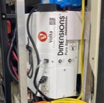

## Overview

The air conditioner uses three sources of power.

1. The main control panel (thermostat/4 switch) uses 12VDC.
2. ModeCOM uses 58VDC
3. Air conditioner unit uses 120VAC (blower/compressor).

## Troubleshooting

1. is the inverter on and volta status green?
2. Check the 120VAC breaker located on the passenger side garage, located in the black access panel, labeled "A/C" (figure 1).
3. (Beast/Stealth only) Ensure "Mode Power" breaker is in the On position and powerstation outlet breaker is off in the 120VAC breaker panel(figure 2).
4. Open the main breaker round access cover on the inverter (figure 3). Check the 30A push button breaker inside the passenger side cabinet, labeled "Main Output Breaker" (figure 4).
5. Power down Volta and let rest for minute to allow power distribution modules (PDM) to reset. Power up Volta.
6. Is thermostat set to cool/auto and desired temperature set lower than ambient temperature?
7. Is there ice formed on the coils under the roof shroud? If so, shut A/C down and let thaw. Ice will not allow for heat dissapation and impede A/C function.
8. When removing the shroud, if you find oily residue, its likely due to a refridgerant leak or compressor failure.
9. If problem persist, contact Storyteller.

Figure 1; 120VAC Breaker Panel

Figure 2: Additional breakers for Stealth/Beast

Figure 3: Location of the access port for inverter.

Figure 4: Volta inverter
