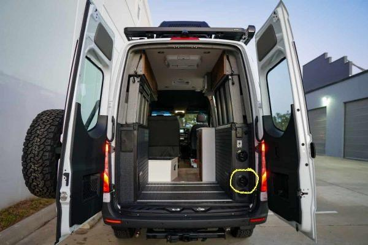
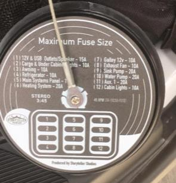
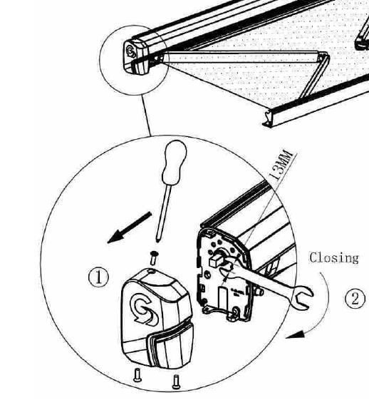

## Troubleshooting

1. In the Volta cabinet (figure 1) check the 2VDC fuse (figure 2).

figure 1: fuse panel location

figure 2: fuse panel itself

## Manually retract awning

1. Remove the three phillips screws (1 top, 2 bottom) on the rear awning cover endcap. Remove endcap.
2. Use a 13mm wrench to manually turn cassette to retrieve awning. It will only turn one way - counter clockwise (retract only) (figure 3).

figure 3: awning diagram
