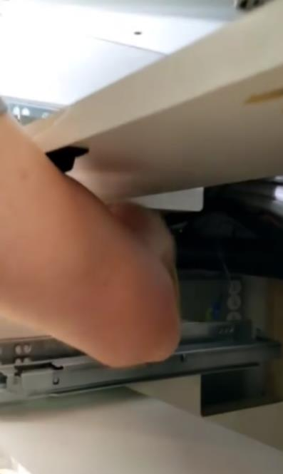

The refrigerator uses two sources of power; 12VDC and 120VAC. With the inverter off, the fridge will solely use 12VDC.

## Troubleshooting

1. Does the fridge light come on? Try with inverter off and on. If light only comes on with inverter, there is a 12VDC power issue.
2. If the fridge is not cooling, is the thermostat set to cool? Is the door closing and maintaining a seal?
3. Perform a full power down for 2 minutes, power back up.
4. If fuses are good, remove the top two drawers of the galley. Through the left cabinet wall (facing the cabinet) there is an access hole. Reach hand through the hole and back towards you to find the 120VAC outlet box (figure 1). Feel to see if the fridge plug is plugged in. Next, in the back (behind cabinets) there is a purple wire and a black wire (ziptied to wiring) that goes to two crimp connectors. This is our 12VDC power feed to the fridge. There should be a red wire and a black wire connected to these. Red to Purple/Black to Black. Make sure those are fully seated (figure 2).
5. If problem persists, contact Storyteller.

figure 1: 120VAC fridge outlet access hole through drawer side

figure 2: 12VDC Leads
