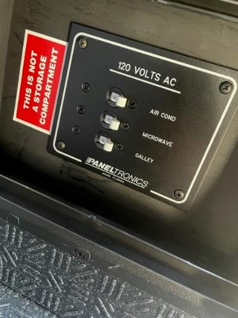
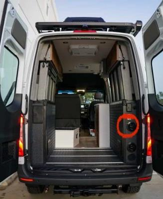

## Troubleshooting

1. is the inverter on and volta status green?
2. Check the 120VAC breaker located on the passanger side garage, located in the black access panel, labeled "Galley" (figure 1).
   - NOTE: 2020 and earlier MODEs do not have a "Galley" circuit breaker in the breaker panel. All of the 120V outlets are fed from teh GFCI outlet on the inverter.
3. Check the 30A push button breaker inside the passanger side cabinet, labeled "Main Output Breaker." This is located behind the main breaker round access cover on the inverter (figure 2).
4. (Beast/Stealth only) Ensure "Mode Power" breaker is in the On position and powerstation outlet breaker is off in the 120VAC breaker panel (figure 3).
5. Verify the GFCI outlet is not tripped by the fold down table.
6. Reset Volta.
   - For 2022 and newer, leave volta off for at least 1 minute for PDM reset.
7. If problem persist, contact Storyteller.

Figure 1: 120VAC Breaker Panel

Figure 2: Location of the access port for inverter.

Figure 3: Additional breakers for Stealth/Beast
