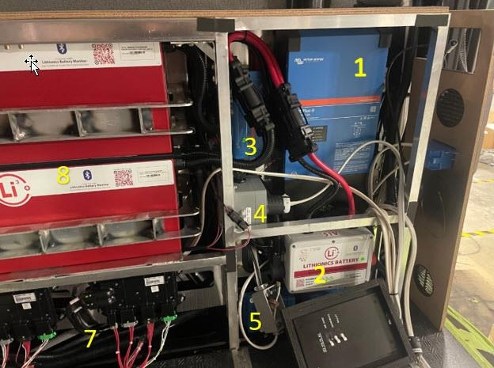

## Summary

Beast, Stealth, Mystic MODEs are equipped with 2 GTO series 165AH 51.2V Lithionics battery packs totalling 16.8KW of power. Classics are equipped with one 165AH pack which is 8.4KW of power. Classic models are upgradable to 16.8KW capacity through a Storyteller service center.

Lithionics has a built-in 10% SOC (State of Charge) shutoff. Once you reach 10% SOC the system will shut itself down to prevent further depletion. Charge as soon as possible! Even though the system is powered down, there is a self-discharge which will further deplete the battery.

Lithionics batteries have built in warmers when the system is on to maintain freezing temperature conditions.

Quick rundown of the components of the M-Power Energy System:

- Victron Cerbo GX: This is a communication gateway to the Lithionics system that allows you to connect using mobile apps (Victronconnect) for monitoring.
- Genasun GVB-8 MPPT Solar charge controller
- Victron Lynx distributor: This is a fuse box/distribution center. This unit houses a majority of the large fuses for the battery system.
- 2 Victron Orion Converters (48 12-20): Convert the Lithionics 51.2VDC to 12VDC for all your 12v appliances.
- Victron Multipus || 3000W Inverter: This inverts the native 51.2VDC to 110VAC for your microwave, air conditioner, wall outlets, etc.
- Lithioncs Advanced External BMS (Battery Management System): Monitors voltage and temperatures for each cell inside the battery pack. If a fault is detected, the BMS will open the main contact until fault is resolved. You can use the Lithionics mobile app to monitor battery/faults/voltage/etc and will also aid in troubleshooting. If the battery reaches the low voltage cutoff, the BMS will open the main contactor to prevent further discharge.

## System Components

1. Multiplus || 3000W Inverter
2. Lithionics Advanced BMS
3. Lynx Distributor
4. Inverter output box
5. Shore power junction box
6. DC/DC Converters (behind BMS)
7. PDMs (power dist modules)
8. Battery pack (1 of 2)
9. Cerbo GX (behind BMS)
10. Genasun Solar MPPT (behind BMS)

## Mobile Apps

The Lithionics system also has bluetooth connectivity.

Lithionics Battery Monitor:

- [Apple App Store](https://apps.apple.com/us/app/lithionics-battery-monitor/id1437635365)
- [Google Play Store](https://play.google.com/store/apps/details?id=com.lithionics.bms)

VictronConnect:

- [Apple App Store](https://apps.apple.com/us/app/victronconnect/id943840744)
- [Google Play Store](https://play.google.com/store/apps/details?id=com.victronenergy.victronconnect&hl=en_US&gl=US)

## Important pack temperatures

| Temp (F) | Description                                   |
| -------- | --------------------------------------------- |
| 140      | System temperature too high/charging disabled |
| 32       | System too cold to charge                     |
