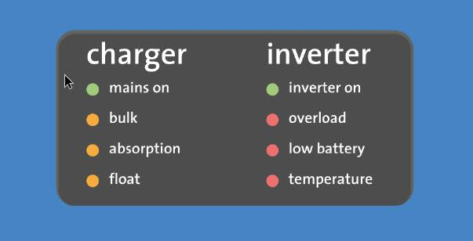
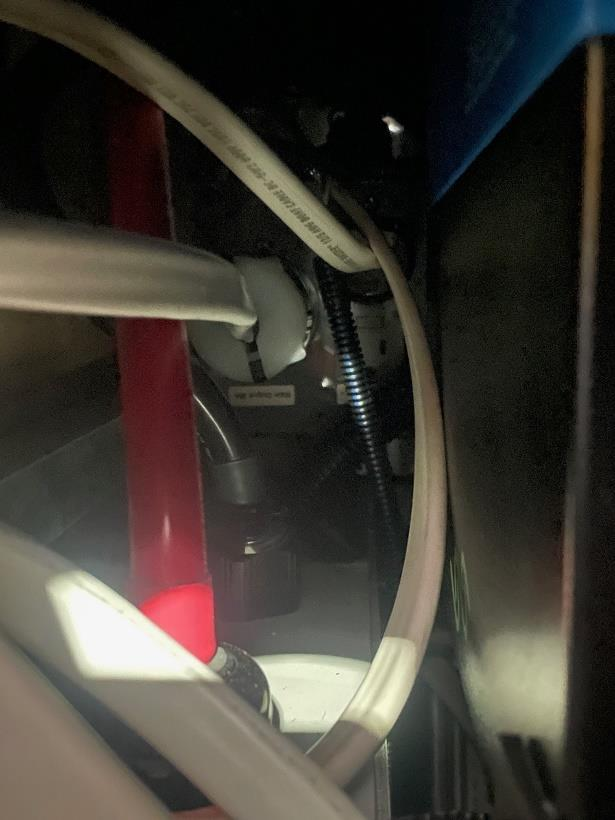

## Galley outlet troubleshooting

1. is the inverter on? Verify LEDs on front of inverter through access cover (figure 1).
2. Check the 120VAC breaker located on the passanger side garage, located in the black access panel, labeled "Galley" (figure 2).
3. Verify the GFCI outlet is not tripped by the fold down table.
4. Perform a full power down for 2 minutes, power back up.
5. If problem persist, contact Storyteller.

Figure 1: Lithionc LEDs

Figure 1; 120VAC Breaker Panel

## Other outlet troubleshooting

1. is the inverter on? Verify LEDs on front of inverter through access cover (figure 1).
2. Check the GFCI outlet on the gray inverter output box (figure 2).
3. Check outside outlet GFCI.
4. Perform a full power down for 2 minutes, power back up.
5. If problem persist, contact Storyteller.

Figure 1: Lithionc LEDs

Figure 1: Location of the access port for inverter.
