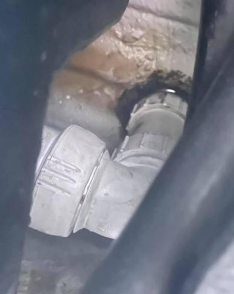

Two things usually prevent the shower from draining. First is a full grey tank and second is an inverted bladder on the shower drain pipe.

## Troubleshooting

### Drain gray water tank

Easiest thing to try for troubleshooting.

Drain the gray water tank, test drain again.

### Check the bladder

Under the van there is a white drain pipe that comes through to floor just aft the gray water tank. The pipe goes to a 90 degree elbow, then to a weird looking straight fitting.

Inside this fitting is a bladder that prevents gray tank smells from coming up through the shower drain. This bladder can be inverted/folded due to a gray tank overflow. The bladder should not be inverted and should be oriented so the flappy end is pointing toward the tank. To access the bladder, make sure the shower pan is as empty as possible. Unscrew the fittings on the elbow and longer straight fitting. Use your fingers or non-sharp object to push the bladder into the fitting. Take extreme care to not tear/puncture the bladder. Make sure it's not rolled up or folded on itself. Reconnect fittings. Test drain.
