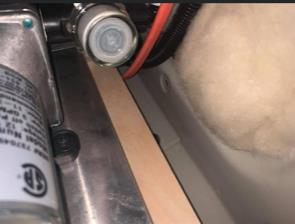

## Troubleshooting

1. If pump is running non-stop or sounds funny, check to see if there is water in the fresh tank.
2. Is the water pump on?
   - 2021 and older: Water pump switch is located on the water system panel.
   - 2022 and newer: check the ModeCOM/galley button panel/rear panel button.
3. If you still have no pressure, check other faucets. If pressure is affecting all, check the pump strainer located in the water cabinet through access panel (figure 1). Turn off the water pump and have towels handy. These strainers collect plastic/manufacturing debris to protect the pump and can fill up over time. Unscrew the strainer, empty out and reinstall.

Figure 1: Water pump strainer, located inside water cabinet access panel.
